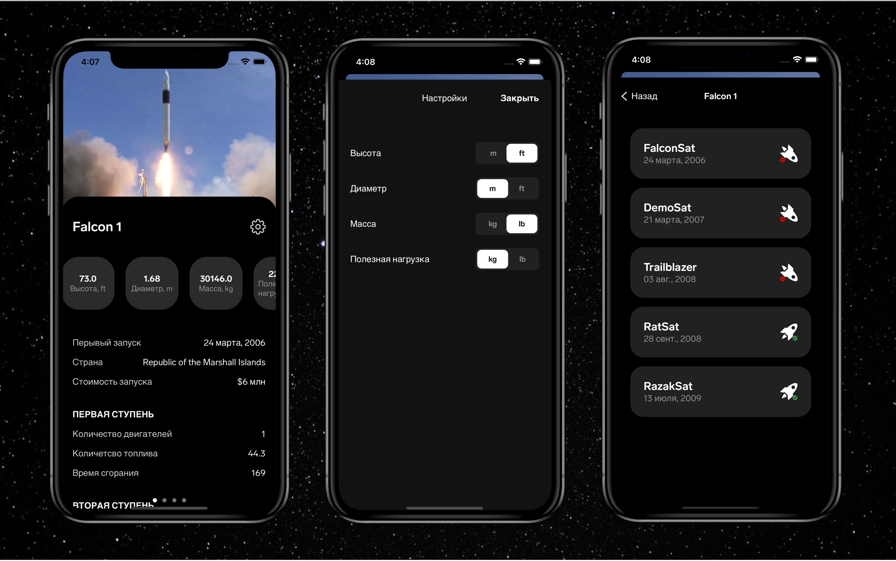

# SpaceX-App

Тестовый Проект для Стажировки в Контур

## Screenshots

## Description

Это мое решение тестового задание на Летнюю Стажировку в Контур.

### Features
- Главный экран со всеми ракетами SpaceX
- Экран со всеми запусками рокет
- Экран настроек
- Данные тянуться с официального API по <a href="https://api.spacexdata.com/v4/rockets">ракетам</a> и по <a href="https://api.spacexdata.com/v4/launches">запускам</a>
- Проделана большяа работа с UI (Sticky Image Header, Custom Page Control, Custom Toggle)
- Реализовано на архитектуре MVVM
